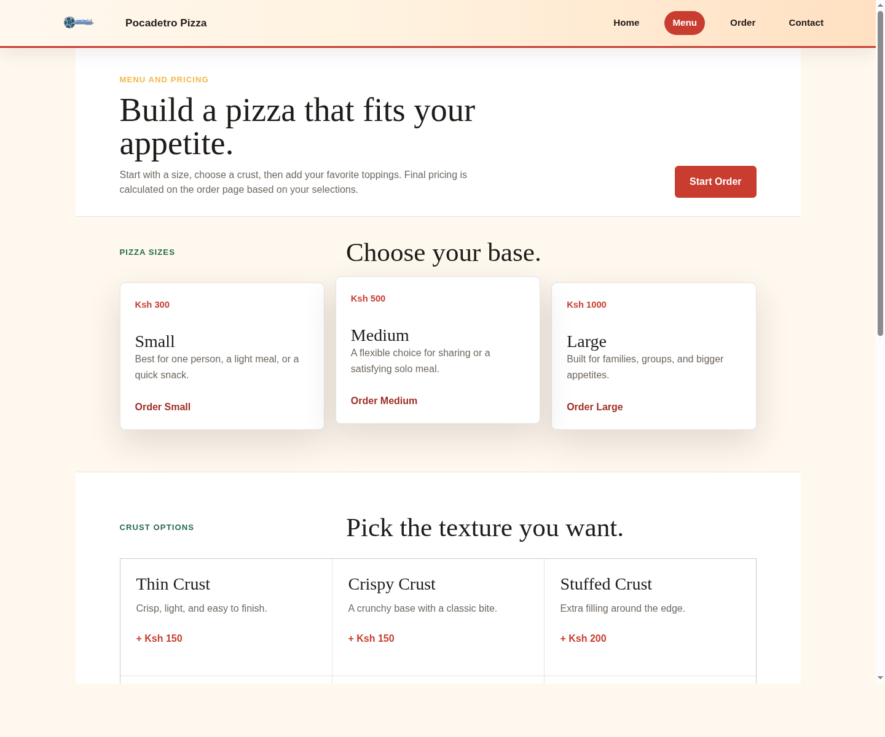
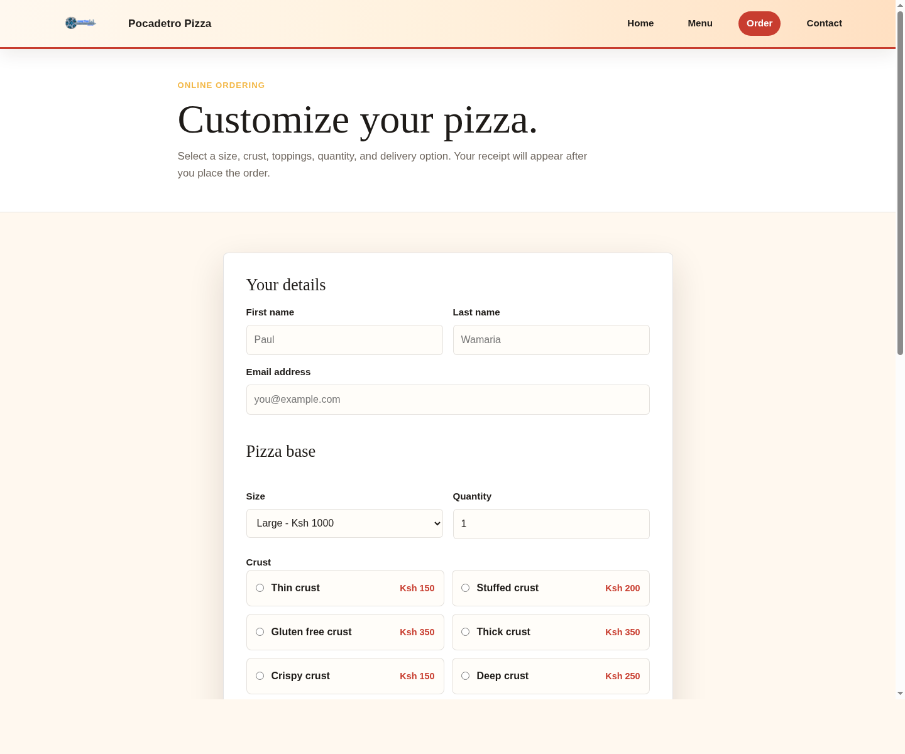

# Pocadetro Pizza

Pocadetro Pizza is a static pizza ordering website. Customers can review the menu, customize a pizza order, choose pickup or delivery, and see a calculated receipt total.

## Live Site

https://paulwamaria.github.io/Pocadetro_Pizza/

## Pages

- `index.html` - homepage with brand introduction and calls to action.
- `imageo.html` - menu page with pizza sizes, crust options, toppings, and prices.
- `order.html` - order form with receipt calculation.
- `contact.html` - contact and support page.

## Screenshots

### Homepage


### Menu



### Order



## Features

- Responsive restaurant-style layout.
- Menu sections for sizes, crusts, and toppings.
- Pizza customization form.
- Delivery or pickup selection.
- Receipt summary with total cost.
- Contact page with email, order, and menu links.

## Technologies

- HTML
- CSS
- Bootstrap CSS
- JavaScript
- jQuery

## Setup

1. Clone the repository.
2. Open the project folder.
3. Open `index.html` in a browser.

No build step or development server is required.

## Project Structure

```text
.
├── contact.html
├── imageo.html
├── index.html
├── order.html
├── css/
│   ├── bootstrap.css
│   ├── imageo.css
│   ├── order.css
│   └── poca.css
├── images/
│   ├── Emryon01-g.png
│   └── Pizzabgjpg
└── js/
    └── poca.js
```

## Author

Paul Kamau Wamaria

## Contact

[paulwamaria@gmail.com](mailto:paulwamaria@gmail.com)

## License

Copyright (c) 2026 Paulwamaria.
